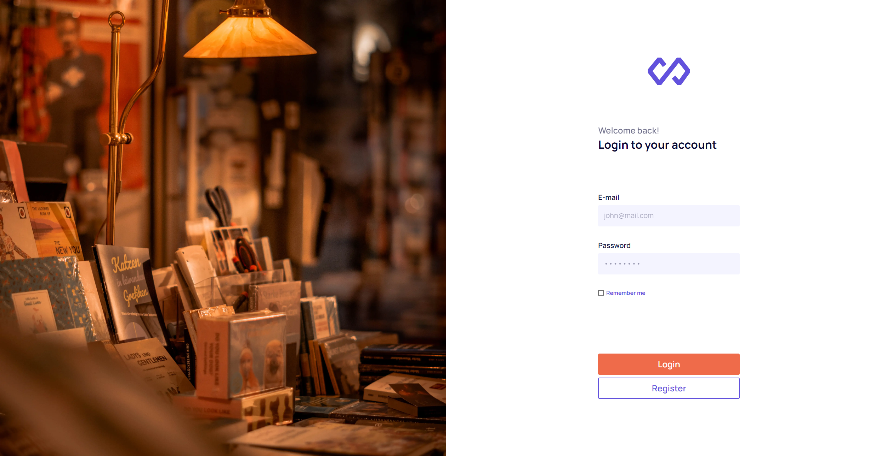

# Product Catalog Project

This project is a product catalog application built using React.js (Next.js) and Tailwind CSS. The application fetches data from a provided API and displays products based on categories.

Live Site: [Product Catalog Project](https://f-dg6hh.vercel.app/)

## Table of Contents

-   [Product Catalog Project](#product-catalog-project)
    -   [Table of Contents](#table-of-contents)
    -   [Features](#features)
    -   [Technologies](#technologies)
    -   [Installation](#installation)
    -   [Usage](#usage)
    -   [Screenshots](#screenshots)

## Features

1. **Login / Registration**

    - User can log in using their email address and password.
    - New users can register by providing their name, email address, and password.
    - Form validations are applied for the email and password fields.
    - "Remember me" option available during login to remember the user's session.

2. **Category-based product display**

    - Displays products fetched from the API based on categories.
    - Clicking on a product navigates to the product details page.

3. **Categories**

    - Displays products under the selected category.
    - Clicking on a product navigates to the product details page.

4. **Product Page**
    - Displays detailed information of the selected product.

## Technologies

-   React.js (Next.js)
-   Redux
-   Tailwind CSS
-   Formik
-   Yup
-   cookies-next

## Installation

-   Clone the repository: git clone [https://github.com/halibal/FDg6hh]
-   Navigate to the project directory: cd product-catalog-project
-   Install the dependencies: npm install

## Usage

-   To run the application in development mode: npm run dev
-   Open your browser and visit `http://localhost:3000`.
-   To build the application for production: npm run build
-   To start the production server: npm start

## Screenshots

 

